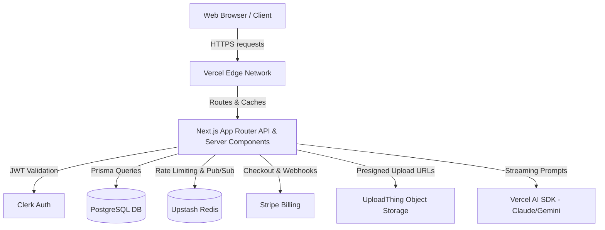

# System Architecture

This document describes the high-level architecture of the AI SaaS Boilerplate Pro.

## System Architecture Diagram

## Auth Flow Walkthrough

1. **User Sign Up/In**: The user authenticates via Clerk's `<SignIn />` or `<SignUp />` components.
2. **Session Token**: Clerk issues a short-lived stateless JWT that is stored in cookies.
3. **Webhook Sync**: Clerk fires an `user.created` webhook asynchronously to our `/api/webhooks/clerk` endpoint, which securely creates a mirroring `User` record in PostgreSQL.
4. **Server Component Access**: In Next.js Server Components, we use `auth()` or our custom `getCurrentUser()` helper to parse the JWT and fetch the user's detailed database record.

## Multi-Tenancy Model

Our multi-tenancy model is based on **Organizations**:
- An `Organization` is a workspace.
- Users can belong to multiple organizations via the `Membership` join table (Role: `OWNER`, `ADMIN`, `MEMBER`).
- Data (e.g., `AiUsageLog`, `Project`) is linked to an `organizationId`, enforcing strict tenant isolation.
- Billing is attached to the user, but resources consumed apply to the active organization.

## Billing Flow (Stripe Webhooks)

1. User clicks "Upgrade" and creates a Stripe Checkout session via `/api/stripe/create-checkout`.
2. The user successfully pays on the hosted Stripe portal.
3. Stripe fires a `checkout.session.completed` event to our webhook endpoint (`/api/webhooks/stripe`).
4. We verify the webhook signature using `STRIPE_WEBHOOK_SECRET`.
5. We update the user's `subscriptionStatus`, `stripePriceId`, and `currentPeriodEnd` in the PostgreSQL database.
6. A recurring Vercel cron job (`/api/cron/check-subscriptions`) verifies overdue subscriptions and downgrades them if past due.

## Real-time Architecture (Redis Pub/Sub → SSE)

For features requiring real-time updates (like team notifications or long-running AI task completions), we use Server-Sent Events (SSE) backed by Redis Pub/Sub:
1. An API route publishes a message: `redis.publish('channel:org_123', JSON.stringify(payload))`.
2. The client connects to an SSE streaming endpoint `/api/sse?channel=org_123`.
3. The server subscribes to Redis. Whenever a message hits the channel, it pushes a chunk to the active HTTP streaming connection.

## Database Schema Overview

The core entities modeled in Prisma include:
- `User`: Mirrors Clerk accounts, stores subscription info.
- `Organization`: Represents a workspace/tenant.
- `Membership`: The many-to-many relationship mapping users to organizations with roles.
- `AuditLog`: Centralized tracking of security and administrative events.
- `AiUsageLog`: Tracks token consumption and AI costs per organization.
- `BlogPost`: Content management for marketing pages.
